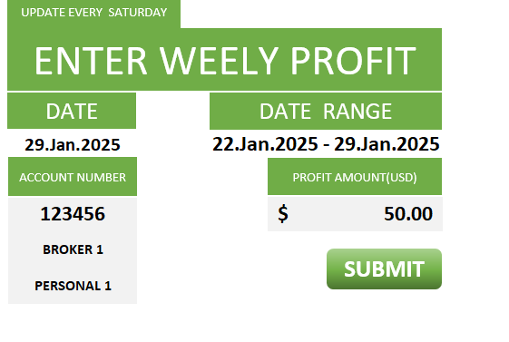
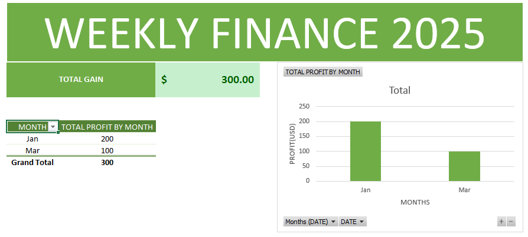
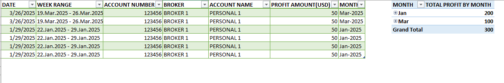
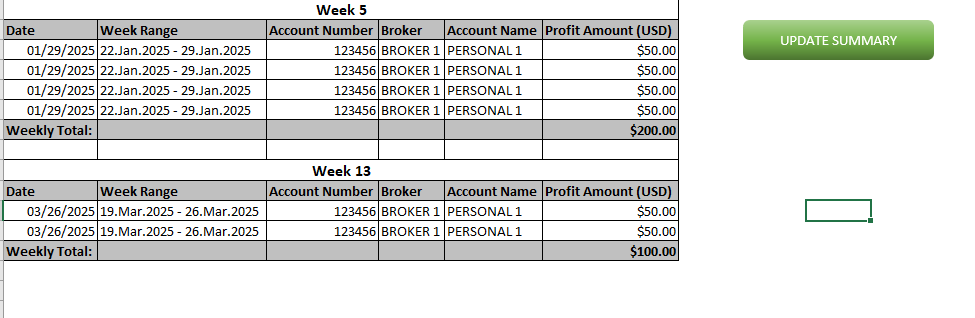

# Multi-Account Financial Weekly Performance Tracker  

## Tools 
**Microsoft Excel**  

## Project Type  
**Financial Tracking**  
- [Excel file Download](https://github.com/GeorgeBonga/Multi-Account-Financial-Weekly-Performance-Tracker/blob/main/Data/Multi-Account%20Financial%20Weekly%20Performance%20Tracker.xlsm)

## Navigation  
- [Background & Overview](#background--overview)  
- [Data Structure Overview](#data-structure-overview)  
- [Executive Summary](#executive-summary)  
- [Future Improvements](#future-improvements)  

## Background & Overview  
The **Multi-Account Financial Weekly Performance Tracker** is an Excel-based tool designed  
to help beginners track their trading performance across multiple accounts.  
It provides a structured way to record and analyze trading data weekly.  

### **Main Goals:**  
✅ Track weekly profits from different trading accounts  
✅ Keep all trading information in one place  
✅ Monitor progress over time  
✅ Improve risk management skills  
✅ Develop good trading record-keeping habits  

## Data Structure Overview  
The template is organized into multiple structured sheets:  

### 🔹 **DATA ENTRY**  
- Users enter date, account number, and profit/loss.  
- Easy dropdown selections for input consistency.  

### 🔹 **DASHBOARD**  
- Visual charts for weekly performance tracking.  
- Simple financial summaries.  

### 🔹 **ACCOUNTS**  
- List of all trading accounts.  
- Account nicknames and status (active/inactive).  

## Executive Summary  

### **Basic Features:**  
✔ Weekly profit tracking for multiple accounts  
✔ Simple data entry system  
✔ Performance charts for easy analysis  
✔ Basic financial reporting  

### **Why It's Useful:**  
✅ Encourages disciplined record-keeping  
✅ Simplifies tracking multiple trading accounts  
✅ Helps identify profitable and unprofitable strategies  

## Future Improvements  
Planned enhancements include:  

🚀 **Advanced Analytics** – Deeper trade performance insights.  
📊 **Power BI Integration** – Interactive data visualization.  

## Screenshots

  
  

  
  

